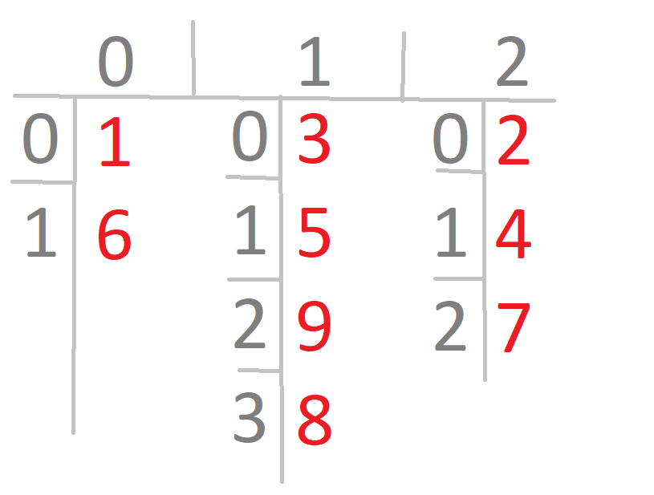

## operatory i ich kolejnosc w javie - poczytać  
zwłaszcza +, -, !, ~ (type) -- operator rzutowania  
tak samo instance of oraz ternary operators i operator potrójny, --y oraz y--  

jezeli mamy zmienną węższego typu, to do zmiennej szerszego typu można ją przypisać  
jeżeli mamy zmienną typu szerszego, a jej wartość cchemy przypisać do zmiennej typu węższego, to musimy jawnie rzutować
wartość na węższy typ.  
słuzy zarowno do rzutowania wartosci w typach podstawowych, jak i wartosci w typach referencyjnych


## casting primitive values


jezeli dodajemy rozne typy java automatycznie promuje węższy do szerszego, doda i wynik zwroci jako szerszy typ

Przykład:  
2 liczby typu short - promocja na int i zwraca inta


Ekspresja jednolinijkowa `value = booleanExpression ? expression1 : expresion2;`

for each in java
```
for (datatype instance : collection) {
// body
}
```

```
int[][] myConplexArray = {{5,2,1,3},{3,9}};
for(int[] mySimpleArray : myComplexArray) {
    for (int i : mySimpleArray) {
        System.out.println(i + "\t");
    }
    System.out.println();
}
```

`String name = new String("Grupa 2151C");` - można i tak

Jeżeli tworzymy obiekt pisząc łańcuch znakow, java sprawdzi czy ma taki obiekt w puli.
Jeżeli ma, to przypisze tylko referencję - jeżeli nie - to utworzy obiekt.  
Chyba, że jawnie utworzymy obiekt.

Jeżeli dodamy 2 stringi "1" + "2" to zwróci "12"

```
(1 + 2 + "c"); // 3c
System.out.println("c" + 1 + 2); // c12

int three = 3;
String four = "4"
System.out.println(1 + 2 + three + four);
// output: "64"
```
  
obiekty klasy string są niezmienialne
  
`s += "2"` to samo, co `s = s + "2"`
```
String s = "1";
s += "2";
s += 3;
sout(s); // 123
```
^ za kazdym razem powstaje nowy obiekt

powstanie obiekt 123 ale nie bedzie zadnej referencji do niego
```
String s1 = "1";
String s2 = s1.concat("2");
s2.concat("3";
System.out.println(s2);
```
  

zestaw metod  klasa String
```
length() -- zwraca ilosc characterów w stringu
charAt(int index) -- zwraca character w danym
indexOf(char ourChar)
String substring(int beginIndex)
toLowerCase()
toUpperCase()
equals() oraz equealsIgnoreCase()
startsWith() oraz endsWith()
replace()
contains()
trim()
strip()
stripLeading() oraz stripTrailing()
intern()
```
przykład
```
String start = "AniMaL       ";
String trimmed = start.trim(); // "AniMaL"
String lowercase = trimmed.toLowerCase(); // "animal"
String result = lowercase.replace('a', 'A'); // "Animal"
```
ale można i tak:
```
String result = "AniMaL   ".trim().toLowerCase().replace('a','A');
System.out.println(result);
```

Jest klasa StringBuilder w której można wykonywać przeróżne działania na obiektach. Warto później dać `.toString()`

## Nie używać `x == y` dla stringów
```
String x = "Hello World";
String y = " Hello World".trim();
sout(x == y); // false - nie zadziała. uzywamy x.equals(y) lub equalsIgnoreCsse
```

metoda toString(), aby skonwertować zmienną na String


overriding - w tej samej klasie  
przesłanianie - pomiędzy klasami

deklarowanie tablicy: `int[] numbers = new int[3];`  
deklarowanie tablicy 2wymiarowej: `int[][] rectangleArray = new int[3][4];`

w javie są tablice tablic, i liczba elementów w różnych tablicach mogą być różne
`int[][] differentSize = {{1, 6}, {3,5,9,8}, {2,4,7}};`

## Tablice dwuwymiarowe:



`import java.util.ArrayList; // import just ArrayList`  
Kolekcja ktora moze przechowywać łańcuchy znaków - obiekty klasy string

`ArrayList<String> list4 = new ArrayList<String>();`

`ArrayList<String> list5 = new ArrayList<>();`

`ArrayList<Animal> animalList = new ArrayList<Animal>()`

w kolekcji arraylist przechowujemy tylko obiekty - jezeli chcemy int to piszemy Integer.

Przykładowe metody ArrayList:
```
add()
remove()
set()
isEmpty()
size()
clear()
contains()
```

```
Integer intWrapped = 1;
Integer intWrapped = new Integer(1);
Integer intWrapped = Integer.valueOf(1); // recommended

int i = intWrapped;
int i = intWrapped.intValue(); // recommended
```

^ wykonanie jawnie, tego, co robi autoboxing